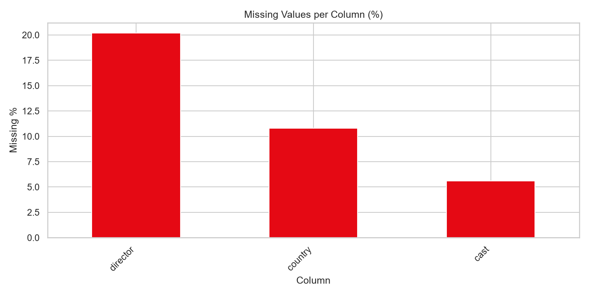
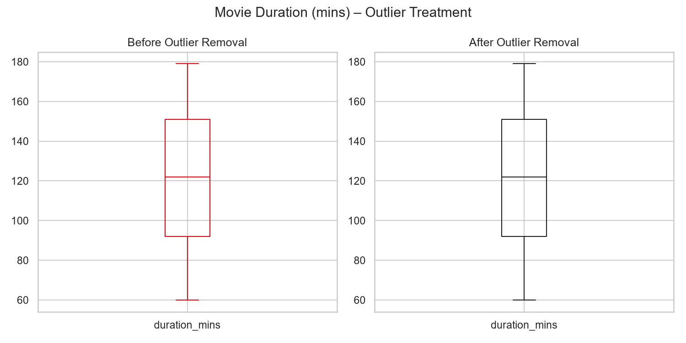
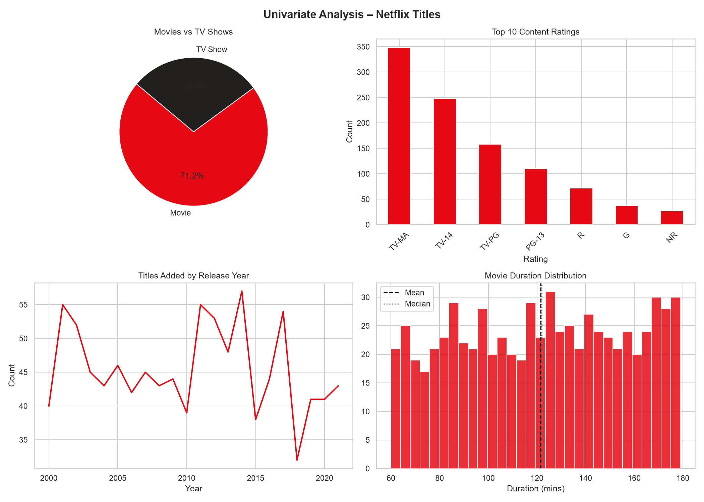
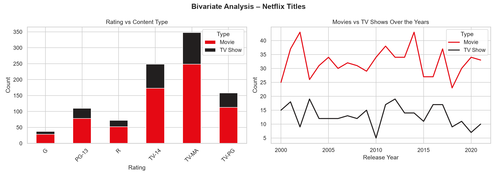
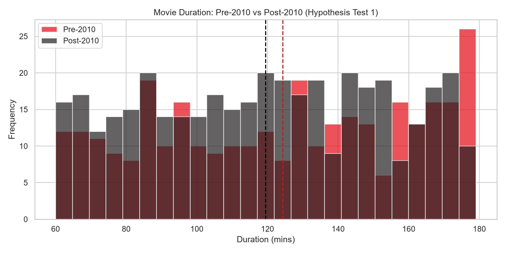

# 📊 Netflix Titles — Exploratory Data Analysis (EDA)

A complete Exploratory Data Analysis (EDA) project on the Netflix Titles dataset using Python. This project focuses on understanding dataset structure, identifying patterns and anomalies, performing statistical analysis, and generating meaningful visual insights.

---

## 🎯 Project Objective

The objective of this project is to:

* Understand the structure and quality of Netflix content data.
* Identify missing values and outliers.
* Discover trends and patterns in Netflix Movies and TV Shows.
* Analyze relationships between different variables.
* Validate assumptions using statistical hypothesis testing.
* Generate visual reports for data-driven insights.

---

## ❓ Business Questions

1. What percentage of Netflix content consists of Movies versus TV Shows?
2. Which content ratings are most common on Netflix?
3. How has Netflix content changed over the years?
4. Are there significant missing values affecting data quality?
5. Are there unusual movie durations (outliers)?
6. Is there a significant difference between movie durations before and after 2010?
7. Is content type related to content rating?

---

## 🛠️ Technologies Used

* Python
* Pandas
* NumPy
* Matplotlib
* Seaborn
* SciPy

---

## 📁 Project Structure

```text
netflix_eda_project/
│
├── netflix_eda.py
├── requirements.txt
├── README.md
├── plot_01_missing_values.png
├── plot_02_outliers.png
├── plot_03_univariate.png
├── plot_04_bivariate.png
├── plot_05_correlation.png
└── plot_06_hypothesis.png
```

---

## 🚀 How to Run

### 1. Clone the Repository

```bash
git clone https://github.com/Nagalakshmivaranasi/netflix-eda-project.git
```

### 2. Navigate to Project Folder

```bash
cd netflix-eda-project
```

### 3. Install Dependencies

```bash
pip install -r requirements.txt
```

### 4. Run the Script

```bash
python netflix_eda.py
```

---

## 📚 Topics Covered

### 1. Dataset Understanding

* Dataset shape
* Column information
* Data types
* Initial exploration

### 2. Data Cleaning

* Missing value analysis
* Missing value treatment
* Outlier detection using IQR

### 3. Summary Statistics

* Descriptive statistics
* Value counts
* Distribution analysis

### 4. Univariate Analysis

* Movies vs TV Shows
* Rating distribution
* Release year trends
* Movie duration distribution

### 5. Bivariate Analysis

* Rating vs Content Type
* Movies vs TV Shows over time
* Correlation analysis

### 6. Hypothesis Testing

* Independent T-Test
* Chi-Square Test
* Statistical significance analysis

---

## 📈 Output Visualizations

### Missing Values Analysis



### Outlier Detection



### Univariate Analysis



### Bivariate Analysis



### Correlation Heatmap


### Hypothesis Testing



---

## 🔍 Key Findings

* Movies constitute the majority of Netflix content.
* Missing values are primarily found in Director, Cast, and Country columns.
* Several movie duration outliers were detected and analyzed.
* Netflix content growth increased significantly after 2015.
* Statistical hypothesis testing was performed using T-Test and Chi-Square Test.
* Visualizations revealed important patterns in ratings, content type, and release trends.

---

## 📊 Output Files Generated

| File Name                  | Description                                  |
| -------------------------- | -------------------------------------------- |
| plot_01_missing_values.png | Missing values analysis                      |
| plot_02_outliers.png       | Outlier detection before and after treatment |
| plot_03_univariate.png     | Univariate analysis charts                   |
| plot_04_bivariate.png      | Bivariate relationship charts                |
| plot_05_correlation.png    | Correlation heatmap                          |
| plot_06_hypothesis.png     | Hypothesis testing visualization             |

---

## 🎓 Skills Demonstrated

* Exploratory Data Analysis (EDA)
* Data Cleaning
* Missing Value Handling
* Outlier Detection
* Data Visualization
* Statistical Analysis
* Hypothesis Testing
* Python Programming
* Git & GitHub

---

## 💡 Dataset Source

Netflix Movies and TV Shows Dataset:

https://www.kaggle.com/datasets/shivamb/netflix-shows

---
